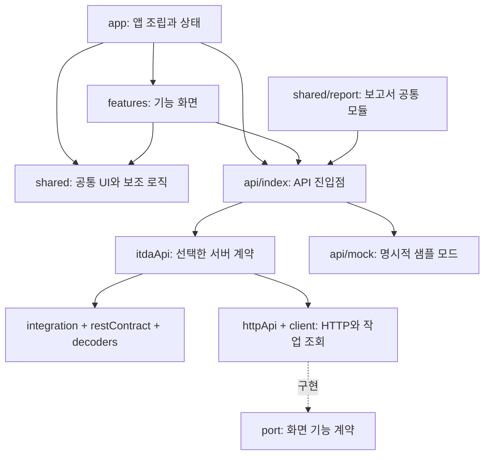

# 프론트엔드 구조와 개발 방법

기록·일정·경과·요약지의 기능별 폴더에서 화면과 동작을 관리한다. 앱 조립과 기록 공간 상태는 `app`, 통신은 `api`, 여러 기능이 함께 쓰는 UI와 로직은 `shared`에 둔다.

## 주요 실행 흐름

- 앱 시작: `main.tsx`가 `App`을 렌더링한다. `useWorkspaceController`는 `api.health()`로 연결을 확인한다. 기록 공간 검사는 해당 규약을 켠 경우에만 수행한다. 가명 조회는 선택 기능이며 일반 조회 실패가 기록 화면을 막지 않는다.
- 기록 저장: `RecordPage`가 `api.createMemo()`를 호출하고 결과를 확인 팝업에 표시한다. API 진입점은 `VITE_USE_MOCK=true`일 때 샘플 구현을, 그 외에는 HTTP 구현을 선택한다. 실제 AI 서버 호출은 백엔드가 담당하며, 프론트엔드는 백엔드의 결과 또는 작업 상태를 조회한다.
- 보고서 조회: 경과와 요약지는 `shared/report`의 조회 훅·기간 선택·근거 표시·그래프를 함께 사용한다. 요약지의 차트 표시 대상은 `features/summary/model.ts`에서 선택한다. `useSummary`는 같은 조회 조건의 요청과 결과를 재사용하고, 저장·수정·삭제 알림을 받으면 캐시를 비운다.
- 기록 공간 전환: 해당 기능을 지원하면 `useWorkspaceController`가 데모 전환과 복구를 관리한다. API 클라이언트는 요청을 시작한 기록 공간과 현재 공간이 다르면 응답을 거절한다.

## 폴더별 책임

| 폴더·파일                        | 담당하는 일                                                                                                                 |
| -------------------------------- | --------------------------------------------------------------------------------------------------------------------------- |
| `app/App.tsx`                    | 앱 화면과 기능 페이지를 조립한다. 경과·요약지는 지연 로딩한다.                                                              |
| `app/useWorkspaceController.ts`  | 연결 확인, 기록 공간 채택·복구·데모 전환, 가명 변경, 미저장 입력 확인, 내비게이션 관련 상태와 효과를 관리한다.              |
| `app/navigation.ts`              | 메뉴 목록과 hash 경로 해석을 정의한다.                                                                                      |
| `app/ErrorBoundary.tsx`          | 하위 화면 렌더링 실패 시 복구 화면을 표시한다.                                                                              |
| `features/records`               | 메모 입력, 결과 팝업, 직접 정리, 원문·사건 수정, 지난 기록 검색, 최근 질문. `EvidenceSelector`는 원문 근거 선택을 담당한다. |
| `features/schedule`              | 진료일·약 변경·질문 등록과 관리 팝업. 각 `*History.tsx`는 정렬·묶음·목록 표시를 담당한다.                                   |
| `features/progress`              | 기간 선택, 경과 그래프, 유형별 변화와 근거 조회.                                                                            |
| `features/summary`               | 요약지 표시·갱신·인쇄. `model.ts`의 `summaryTrendTypes`는 API 응답에서 차트 표시 대상을 선택한다.                           |
| `api/port.ts`, `api/types.ts`    | 화면이 사용하는 기능 계약과 데이터 타입.                                                                                    |
| `api/integration.ts`             | 적용할 서버 계약, 인증 헤더, 지원 기능 선택.                                                                                |
| `api/restContract.ts`            | 메서드별 경로·요청 변환·응답 검사 연결.                                                                                     |
| `api/decoders.ts`                | 서버 데이터의 필드 검사와 코드·라벨 변환.                                                                                   |
| `api/httpApi.ts`                 | 계약 실행, AI 작업 조회, 전체 제한 시간, 지원 기능 검사.                                                                    |
| `api/client.ts`                  | HTTP 전송, 오류 변환, 요청 경로·기록 공간 보호.                                                                             |
| `api/itdaApi.ts`, `api/index.ts` | 선택한 계약으로 HTTP API 구성, 실제 API와 샘플 모드 선택.                                                                   |
| `api/mock`                       | 실제 AI·서버 없이 사용하는 합성 샘플 구현.                                                                                  |
| `shared/ui`                      | 모달, 확인창, 로고 등 여러 화면에서 쓰는 UI.                                                                                |
| `shared/report`                  | 경과와 요약지가 공유하는 기간 선택, 근거, 그래프, 데이터 조회 훅과 표시 함수.                                               |
| `shared/lib`                     | 날짜, 이벤트 표시명, 근거 날짜, 기간 선택, 진료 준비 보조 함수·훅.                                                          |
| `shared/styles`                  | 색상 등 공통 토큰과 기록·일정의 공통 CSS.                                                                                   |

`shared/report`는 보고서 DTO와 API를 사용하는 공통 모듈이다. `shared/ui`는 API에 의존하지 않는 모달·확인창·로고를 제공한다. `shared/lib`는 날짜 계산 같은 보조 함수와 React 상태를 사용하는 기간 선택 훅을 포함한다.

## 의존 방향

이 그림은 주요 실행 의존을 보여준다. 세부 기준은 다음과 같다.

- `app`은 기능의 `index.ts`를 통해 페이지를 조립한다. 기능끼리는 다른 기능의 페이지 내부를 직접 가져오지 않는다.
- 화면과 조회 훅은 `api` 진입점을 사용한다. 직접 `fetch`하거나 샘플 구현을 선택하는 분기를 각 화면에 추가하지 않는다.
- `shared`에서 `app` 또는 `features`를 참조하지 않는다. `shared/report`는 API 호출과 DTO 사용이 가능하다.
- `api`의 HTTP·변환 모듈은 기능 화면이나 React 상태를 참조하지 않는다. `api/port.ts`와 `types.ts`는 화면에 필요한 기능·데이터를 정의하고, `restContract.ts`와 `decoders.ts`는 서버 요청·응답을 변환한다.
- 현재 `api/mock`은 `shared/lib/date.ts`, `shared/lib/visitPreparation.ts`를 재사용한다. 해당 보조 함수는 UI·API 실행 코드를 가져오지 않으며, 진료 준비 함수의 DTO 참조는 `import type`이다.

의존 방향은 코드 리뷰에서 import와 역할을 검토하는 기준이다. 별도의 자동 의존 검사 규칙은 없다.

## 데이터와 화면 상태 기준

- **기록 날짜:** 사용자가 선택한 `record_date`가 메모와 사건의 날짜다. 지난 기록 검색과 샘플 집계도 이 날짜를 사용한다. 문장 속 상대 날짜로 별도의 발생일을 추정하지 않는다.
- **확인 흐름:** 작성 화면은 메모 입력에 집중하고, 정리 결과는 팝업에서 확인한다. 새 메모를 확정하면 작성 화면을 초기화한다. 지난 기록에서 연 팝업은 닫거나 삭제해도 해당 목록으로 돌아가며, 작성 중이던 새 메모를 바꾸지 않는다.
- **질문:** 기록 화면의 최근 질문은 기본적으로 접혀 있고, 저장에 성공하면 최근 3개를 펼쳐 보여준다. 전체 질문은 일정에서 관리한다. 요약지 포함 여부는 질문의 `created_at`과 선택 기간으로 판단한다.
- **일정 관리:** 목록의 항목 전체가 관리 팝업을 여는 버튼이다. 입력 폼과 목록의 상태는 `SchedulePage`가 소유하고, 진료일·약 변경·질문 목록은 각각의 컴포넌트로 분리한다.
- **보고서 기간:** `useReportSelection`이 hash의 `as_of`, `period_start`를 공유한다. 시작일이 지정되지 않으면 응답의 기본 기간을 표시한다. 유효한 날짜를 선택하면 별도 적용 버튼 없이 조회하며, 날짜 입력 중에는 이전 기간의 요약지를 출력하지 않는다.
- **약 변경·낙상:** 응답의 `medications`와 `falls`를 합치지 않는다. 경과·요약지·PDF에서 각각 별도 영역으로 표시하고, 각 영역 안에서 날짜순으로 정렬한다.
- **출력 전 확인:** 요약에서 제외된 기록이 있으면 PDF 저장 전에 검토 팝업을 연다. 여기서 개별 메모를 열어 확인·삭제하거나 닫으면 같은 기간의 출력 검토로 돌아온다. 마지막 기록을 처리한 뒤에도 자동 인쇄하지 않고 사용자 선택을 기다린다.

저장·수정·삭제 후 발생하는 `itda-final-updated` 이벤트로 다른 화면의 데이터를 갱신한다. 결과 팝업의 출발 화면과 복귀 경로, 미저장 입력, 처리 중인 요청을 함께 고려해 화면 이동을 변경한다. 날짜 선택·목록·팝업을 수정할 때는 해당 흐름을 다루는 `tests/record-*.test.tsx`, `tests/schedule-flow.test.tsx`, `tests/visit-preparation.test.tsx`, 보고서 테스트를 확인한다.

## 기능을 추가하거나 수정하는 순서

1. 서버 계약 변경은 `api/integration.ts`에서 선택한 어댑터의 요청·응답 변환에 반영한다. 화면이 필요한 정보 자체가 바뀌면 `api/port.ts`, `types.ts`도 수정한다.
2. 기능 추가 시 `port.ts`에 화면 메서드를 정의하고 `restContract.ts`의 매핑과 `mock/mockApi.ts`의 샘플 구현을 추가한다. `httpApi.ts`가 공통 전송·응답 검사·작업 조회를 실행한다.
3. 해당 `features` 폴더에서 화면과 동작을 연결한다. 새 기능이면 페이지와 `index.ts`부터 만들고 `app`에 연결한다.
4. 독립적으로 읽거나 재사용할 필요가 생긴 표시 단위는 `components/`, 상태 흐름은 `hooks/`, 순수 계산은 `model.ts` 등으로 분리한다. 작은 기능에 빈 계층을 미리 만들 필요는 없다.
5. API 변경은 요청·오류·기록 공간 조건을, 화면 변경은 사용자가 수행하는 흐름을 `tests`에서 검증한다. 저장·재시도·기간 변경·이탈 동작에 영향이 있는지 확인한다.
6. `pnpm typecheck`, `pnpm lint`, `pnpm test`, `pnpm format:check`, `pnpm build`로 확인하고, 스타일 변경은 브라우저에서도 확인한다.

한 기능에서만 쓰는 코드는 그 기능 폴더에 둔다. 여러 기능이 실제로 함께 쓰고 같은 의미를 가질 때 `shared`로 이동한다. 예를 들어 요약지에만 필요한 그래프 유형 선택은 `summary/model.ts`에 둔다.

## 상태와 스타일 관리

일부 기능 페이지는 JSX, 로컬 state와 처리 함수를 함께 가진다. 기록 확인·수정, 미저장 입력, 모달, 요청 순서처럼 연결된 동작의 상태 소유자를 명확히 하고, 역할이 커지면 컴포넌트·훅·계산 함수로 나눈다. 분리할 때는 사용자 흐름과 요청 순서를 테스트로 확인한다.

Tailwind 의존성과 Vite 플러그인을 구성하며 화면 스타일은 CSS 파일에서 관리한다. 기능 CSS는 기능 폴더, 여러 화면이 공유하는 CSS는 `shared/styles` 또는 해당 공통 모듈에 둔다. 전역 스타일을 변경하면 모든 화면과 요약지 인쇄에 미치는 영향을 확인한다.

`config/labels.json`은 팀 동결본이며 `src/api/labels.ts`에서 읽는다. 라벨 변경은 이유를 기록하고 팀 논의를 거친다. 호출 상세는 [API 연동 가이드](api-contract.md), 구조 선택의 이유는 [결정 기록](decisions.md)에 정리한다.
